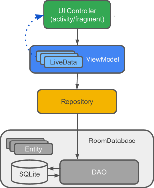
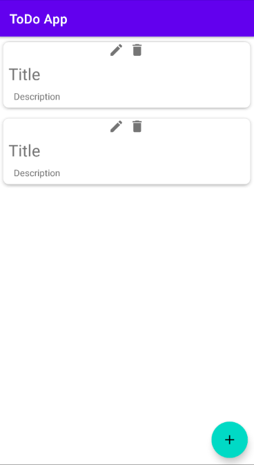

# ToDo App
Application with a clean architecture this built with
 - MVVM
 - Extension Functions
 - Room Database
 - Navigation Components
 - ViewBinding
 - Coroutines 
 - Unit Tests

 # Architecture
 
 
 
 # Get it on Google PlayStore full app
 
 
 
 # Screen

# Support

Like what you see?

- ⭐ **Star This repo!** — it helps more people discover it!
- 👍🏽 **Follow me** 

Thanks for your support! 🫶🏽

