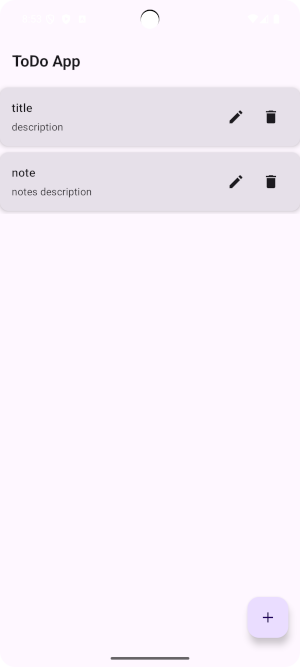

# Todo App
Application with a clean architecture this built with
 - MVVM
 - Room Database
 - Migration Jetpack Compose
 - Flow
 - Coroutines 
 - Unit Tests

for legacy project you can see branch 'legacy'

 # Architecture
 
 
 
 # Get it on Google PlayStore
 
 
 
 # Screen

# Support

Like what you see?

- ⭐ **Star This repo!** — it helps more people discover it!
- ğŸ‘🽠**Follow me** 

Thanks for your support! 🫶🏽